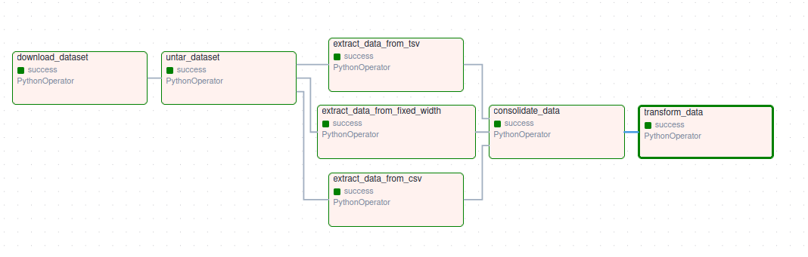

# ETL Pipeline with Apache Airflow

This repository contains a simple data engineering project that demonstrates how to build an ETL pipeline using Apache Airflow. The project processes road traffic data from various toll plazas, consolidating data from different formats into a single, transformed CSV file.

## Project Overview

### Context

As a data engineer working for a data analytics consulting company, your task is to de-congest the national highways by analyzing road traffic data from different toll plazas. Each highway operator provides data in a different format, so the goal is to collect the data, extract useful information, consolidate it, and then transform it for analysis.

### Workflow

- **Data Sources**: Data is available in CSV, TSV, and fixed-width file formats.
- **ETL Process**: The pipeline extracts data from the different formats, consolidates the data, transforms specific fields, and saves the final output in a CSV format for downstream analysis.

### DAG Chart

Below is the chart representing the Airflow DAG for the ETL process.



## Project Structure

```bash
ETL-PIPELINE-AIRFLOW/
│
├── dags/
│   └── ETL_toll_data.py           # The main DAG script
├── airflow_settings.yaml          # Airflow settings file 
├── .env                           # Environment variables 
├── dag-chat/
│   └── dag_chart.png              # Image of the DAG workflow
├── README.md                      # Project documentation
└── requirements.txt               # Python dependencies
```

# Python dependencies

## Prerequisites

To run this project, you will need:

- **Docker**: Docker and Docker Compose are required to run Apache Airflow with Astro.
- **Astro CLI**: Install the Astro CLI to manage your Airflow deployment.

### Installing Astro CLI

To install the Astro CLI, run:

```bash
curl -sSL https://install.astronomer.io | sudo bash
```

You can also install it using Homebrew:
```bash
brew install astro
```
For detailed installation instructions, visit 

# Getting Started

Follow these steps to get your project up and running:

## 1. Clone the Repository

Clone this repository to your local machine:
```bash
git clone https://github.com/VM-137/ETL-PIPELINE-AIRFLOW.git
cd ETL-PIPELINE-AIRFLOW
```

## 2. Start Astro

Astro is a platform for running Airflow locally in a Docker container. To start the Airflow environment, use the following command:
```bash
astro dev start
```
This will start the Airflow web server and scheduler on localhost:8080.

## 3. Access Airflow UI

Once Airflow is running, access the web UI by navigating to:
```bash
http://localhost:8080
```

## 4. Upload the DAG

Your DAG file (ETL_toll_data.py) is located in the dags/ directory. Astro will automatically detect this DAG and display it in the Airflow UI.

## 5. Trigger the DAG

Once the DAG is visible in the UI, you can trigger it manually or wait for it to be triggered based on the schedule interval (@daily).

## 6. Monitor the DAG

Monitor the progress of your DAG by following the task logs in the Airflow UI. Each task will display logs, including status updates and errors (if any).

# Pipeline Details

The ETL pipeline involves the following steps:

* Download Dataset: Downloads a dataset in .tgz format from a remote URL.
* Untar Dataset: Extracts the .tgz file into its individual components (CSV, TSV, fixed-width text file).
* Extract Data from CSV: Extracts relevant fields from the CSV file.
* Extract Data from TSV: Extracts relevant fields from the TSV file.
* Extract Data from Fixed-Width File: Extracts relevant fields from the fixed-width text file.
* Consolidate Data: Combines the extracted data from all formats into a single consolidated CSV.
* Transform Data: Transforms specific fields, such as converting the vehicle type to uppercase.

# DAG Breakdown

Here is a breakdown of the tasks in the DAG:

* download_dataset: Downloads the toll data from the specified URL.
* untar_dataset: Untars the downloaded data.
* extract_data_from_csv: Extracts required fields from the CSV file.
* extract_data_from_tsv: Extracts required fields from the TSV file.
* extract_data_from_fixed_width: Extracts required fields from the fixed-width file.
* consolidate_data: Consolidates the data from CSV, TSV, and fixed-width files.
* transform_data: Transforms specific fields in the consolidated data.

# Logging

This project uses Python's built-in logging module to log the execution of each task. Logs are stored in the Airflow UI and can be accessed per task instance.
Next Steps

After running this ETL pipeline, you can further explore:

* Automating with More Data Sources: Extend the pipeline to handle other types of data sources.
* Adding Data Validation: Add data validation steps to ensure data quality.
* Data Load (ELT): Load the processed data into a data warehouse or other analytical tools.

# Troubleshooting
Common Issues

* Permission Denied: Ensure Docker is running with the correct permissions, and your user is part of the docker group.
* Astro CLI Not Detected: Ensure that the Astro CLI is installed and available in your system's PATH.

### License

This project is licensed under the MIT License.